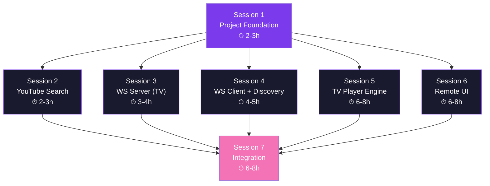

# 🎤 Kế Hoạch Triển Khai: Ứng Dụng Karaoke 2-in-1 (TV & Remote)

## Tổng Quan

Xây dựng một ứng dụng Flutter duy nhất (1 APK) tích hợp 2 chế độ:
- **TV Receiver:** Hiển thị video YouTube Karaoke trên Android TV / TV Box
- **Phone Remote:** Điều khiển tìm kiếm, chọn bài, phát/tạm dừng từ điện thoại

**Công nghệ:** Flutter + Dart  
**Mục tiêu APK:** < 15 MB  
**Cấu trúc:** 7 phiên công việc độc lập → 7 agent song song  

---

## 3 Điểm Lưu Ý Chí Mạng (Đã Tích Hợp)

> [!CAUTION]
> ### 1. Wake Lock cho TV
> Android TV tự bật Screen Saver / Sleep Mode khi không nhận tương tác D-pad. Giải pháp: dùng `wakelock_plus` gọi `WakelockPlus.enable()` trên TV Player Screen. *→ Tích hợp vào Session 5.*

> [!CAUTION]
> ### 2. Smart Scan Fallback cho mDNS
> mDNS bị Android bóp hiệu năng hoặc Router chặn Multicast. Giải pháp: viết hàm Smart Scan quét subnet (`.1` → `.255` trên port 8080) làm fallback khi mDNS thất bại. *→ Tích hợp vào Session 4.*

> [!CAUTION]
> ### 3. Đồng bộ Progress Bar từ TV về Phone
> Phone cần biết video đang chạy đến giây thứ mấy. Giải pháp: `setInterval` 1s trong JS trên TV lấy `player.getCurrentTime()` + `player.getDuration()` rồi bắn `SYNC` message về Phone. *→ Tích hợp vào Session 5.*

---

## Kiến Trúc Tổng Thể & Hợp Đồng Giao Tiếp (Shared Contracts)

> [!IMPORTANT]
> ### Mọi agent PHẢI tuân thủ các hợp đồng dưới đây
> Đây là "ngôn ngữ chung" để 7 phiên công việc độc lập có thể ghép nối hoàn hảo mà không xung đột. Mỗi agent phải đọc phần này trước khi bắt đầu.

### A. Cấu trúc thư mục chuẩn

```
lib/
├── main.dart
├── app.dart
│
├── core/
│   ├── constants/
│   │   ├── app_colors.dart
│   │   ├── app_strings.dart
│   │   └── ws_protocol.dart
│   ├── models/
│   │   ├── song.dart
│   │   └── ws_message.dart
│   └── services/
│       ├── youtube_search_service.dart
│       └── network_info_service.dart
│
├── tv/
│   ├── screens/
│   │   ├── tv_waiting_screen.dart
│   │   └── tv_player_screen.dart
│   ├── services/
│   │   ├── ws_server_service.dart
│   │   └── tv_player_controller.dart
│   └── widgets/
│       └── tv_now_playing_overlay.dart
│
├── remote/
│   ├── screens/
│   │   ├── remote_connect_screen.dart
│   │   └── remote_control_screen.dart
│   ├── services/
│   │   ├── ws_client_service.dart
│   │   ├── discovery_service.dart
│   │   └── queue_manager.dart
│   └── widgets/
│       ├── search_bar_widget.dart
│       ├── search_results_widget.dart
│       ├── playback_controls.dart
│       └── queue_list_widget.dart
│
└── mode_selection/
    └── mode_selection_screen.dart
```

### B. Model: `Song` (file: `lib/core/models/song.dart`)

```dart
class Song {
  final String videoId;
  final String title;
  final String thumbnailUrl;
  final String duration;       // Định dạng "mm:ss"
  final String channelName;

  const Song({
    required this.videoId,
    required this.title,
    required this.thumbnailUrl,
    required this.duration,
    required this.channelName,
  });

  Map<String, dynamic> toJson() => {
    'videoId': videoId,
    'title': title,
    'thumbnailUrl': thumbnailUrl,
    'duration': duration,
    'channelName': channelName,
  };

  factory Song.fromJson(Map<String, dynamic> json) => Song(
    videoId: json['videoId'] as String,
    title: json['title'] as String,
    thumbnailUrl: json['thumbnailUrl'] as String,
    duration: json['duration'] as String,
    channelName: json['channelName'] as String,
  );
}
```

### C. Model: `WsMessage` (file: `lib/core/models/ws_message.dart`)

```dart
enum WsType { command, event, sync }

class WsMessage {
  final WsType type;
  final String action;
  final Map<String, dynamic>? payload;

  const WsMessage({
    required this.type,
    required this.action,
    this.payload,
  });

  Map<String, dynamic> toJson() => {
    'type': type.name.toUpperCase(),
    'action': action,
    if (payload != null) 'payload': payload,
  };

  factory WsMessage.fromJson(Map<String, dynamic> json) => WsMessage(
    type: WsType.values.firstWhere(
      (e) => e.name.toUpperCase() == json['type'],
    ),
    action: json['action'] as String,
    payload: json['payload'] as Map<String, dynamic>?,
  );

  String encode() => jsonEncode(toJson());
  static WsMessage decode(String raw) => WsMessage.fromJson(jsonDecode(raw));
}
```

### D. Giao thức WebSocket — Bảng lệnh đầy đủ

| # | Direction | Type | Action | Payload | Mô tả |
|---|-----------|------|--------|---------|-------|
| 1 | Remote → TV | `COMMAND` | `play_now` | `{videoId, title}` | Phát bài ngay |
| 2 | Remote → TV | `COMMAND` | `pause` | – | Tạm dừng |
| 3 | Remote → TV | `COMMAND` | `resume` | – | Tiếp tục phát |
| 4 | Remote → TV | `COMMAND` | `seek_forward` | `{seconds: 10}` | Tua tới |
| 5 | Remote → TV | `COMMAND` | `seek_backward` | `{seconds: 10}` | Tua lùi |
| 6 | Remote → TV | `COMMAND` | `next` | `{videoId, title}` | Chuyển bài tiếp |
| 7 | TV → Remote | `EVENT` | `video_ended` | – | Video kết thúc |
| 8 | TV → Remote | `EVENT` | `video_error` | `{code, message}` | Lỗi phát video |
| 9 | TV → Remote | `EVENT` | `connected` | – | Kết nối thành công |
| 10 | TV → Remote | `SYNC` | `player_state` | `{state, position, duration}` | Đồng bộ progress mỗi 1s |

### E. Design Tokens (file: `lib/core/constants/app_colors.dart`)

```dart
abstract class AppColors {
  // === Nền ===
  static const background     = Color(0xFF0D0D1A);  // Deep dark
  static const surface        = Color(0xFF1A1A2E);  // Elevated dark
  static const surfaceLight   = Color(0xFF252542);  // Cards, modals

  // === Chủ đạo ===
  static const primary        = Color(0xFF7C3AED);  // Vivid purple
  static const primaryLight   = Color(0xFF9F67FF);  // Hover state
  static const accent         = Color(0xFFF472B6);  // Warm pink

  // === Text ===
  static const textPrimary    = Color(0xFFFFFFFF);
  static const textSecondary  = Color(0xFFB0B0C8);
  static const textMuted      = Color(0xFF6B6B8A);

  // === Trạng thái ===
  static const success        = Color(0xFF10B981);
  static const error          = Color(0xFFEF4444);
  static const warning        = Color(0xFFF59E0B);

  // === TV Specific ===
  static const tvFocusBorder  = Color(0xFFFFFFFF);  // Viền trắng khi D-pad focus
  static const tvFocusGlow    = Color(0x337C3AED);  // Glow tím nhẹ
}
```

### F. Dependencies hoàn chỉnh (file: `pubspec.yaml`)

```yaml
dependencies:
  flutter:
    sdk: flutter
  youtube_explode_dart: ^3.1.0       # Search không cần API Key
  flutter_inappwebview: ^6.0.0       # WebView nâng cao cho TV Player
  web_socket_channel: ^3.0.0         # WebSocket Client (Phone)
  nsd: ^3.0.0                        # mDNS discovery
  provider: ^6.1.0                   # State management
  shared_preferences: ^2.3.0         # Lưu IP, settings
  cached_network_image: ^3.4.0       # Cache thumbnail
  shimmer: ^3.0.0                    # Loading skeleton
  network_info_plus: ^6.0.0          # Lấy IP Wi-Fi
  wakelock_plus: ^1.2.0              # ★ Giữ TV luôn sáng
  google_fonts: ^6.2.0               # Typography premium
  reorderables: ^0.6.0               # Kéo thả queue
```

---

## ━━━━━━━━━━━━━━━━━━━━━━━━━━━━━━━━━━━━━━━━━━━━━━━━━━
## SESSION 1: Project Foundation & Shared Core
## ━━━━━━━━━━━━━━━━━━━━━━━━━━━━━━━━━━━━━━━━━━━━━━━━━━

**Agent:** Agent 1 — Project Architect  
**Ước lượng:** 2–3 giờ  
**Phụ thuộc:** Không (Session gốc)  
**Các session khác cần chạy SAU session này**

### Mô tả
Khởi tạo toàn bộ nền móng dự án Flutter. Tạo skeleton cấu trúc thư mục, cài đặt dependencies, cấu hình Android Manifest cho cả TV + Phone, và viết tất cả shared models/constants mà 6 agent còn lại sẽ dùng.

### Danh sách công việc chi tiết

#### 1.1 Khởi tạo Flutter Project
```bash
flutter create --org com.karaoke --project-name yt_control --platforms android .
```

#### 1.2 Cấu hình `pubspec.yaml`
- Thêm toàn bộ dependencies theo danh sách ở mục F (Shared Contracts)
- Thiết lập `flutter` section: fonts (Google Fonts), assets
- Chạy `flutter pub get` xác nhận không lỗi

#### 1.3 Cấu hình `AndroidManifest.xml`
File: `android/app/src/main/AndroidManifest.xml`
- Thêm permissions: `INTERNET`, `ACCESS_NETWORK_STATE`, `ACCESS_WIFI_STATE`, `CHANGE_WIFI_MULTICAST_STATE`
- Thêm Android TV features: `android.software.leanback` (required=false), `android.hardware.touchscreen` (required=false)
- Thêm `android:banner="@drawable/banner"` vào `<application>`
- Thêm `<category android:name="android.intent.category.LEANBACK_LAUNCHER" />` vào intent-filter
- Cấu hình `android:usesCleartextTraffic="true"` (cho WebSocket trên mạng nội bộ)

#### 1.4 Tạo toàn bộ cấu trúc thư mục
Tạo tất cả các thư mục theo cấu trúc ở mục A (Shared Contracts), mỗi thư mục có 1 file placeholder `.gitkeep` hoặc file skeleton rỗng.

#### 1.5 Viết Shared Models
- `lib/core/models/song.dart` — Sao chép chính xác từ mục B
- `lib/core/models/ws_message.dart` — Sao chép chính xác từ mục C

#### 1.6 Viết Shared Constants
- `lib/core/constants/app_colors.dart` — Sao chép chính xác từ mục E
- `lib/core/constants/app_strings.dart`:
  ```dart
  abstract class AppStrings {
    static const appName = 'YT Karaoke';
    static const modeTV = 'CHẾ ĐỘ TIVI';
    static const modeRemote = 'ĐIỀU KHIỂN TỪ XA';
    static const modeTVDesc = 'Dùng cho Android TV / TV Box';
    static const modeRemoteDesc = 'Dùng cho điện thoại';
    static const waitingTitle = 'Đang chờ kết nối...';
    static const searchHint = 'Tìm bài hát...';
    static const karaokeToggle = 'Karaoke';
    static const addToQueue = 'Chọn bài';
    static const queueEmpty = 'Chưa có bài nào trong danh sách';
    static const connectionLost = 'Mất kết nối. Đang thử lại...';
    static const allSongsPlayed = 'Hết bài! Hãy chọn thêm bài nhé!';
    static const noResults = 'Không tìm thấy bài hát nào';
    static const retrySearch = 'Hệ thống đang bảo trì, vui lòng thử lại sau';
  }
  ```
- `lib/core/constants/ws_protocol.dart`:
  ```dart
  abstract class WsProtocol {
    static const int port = 8080;
    static const String serviceType = '_karaoke-receiver._tcp';
    static const String serviceName = 'YT Karaoke TV';

    // Actions (Remote → TV)
    static const String playNow = 'play_now';
    static const String pause = 'pause';
    static const String resume = 'resume';
    static const String seekForward = 'seek_forward';
    static const String seekBackward = 'seek_backward';
    static const String next = 'next';

    // Events (TV → Remote)
    static const String videoEnded = 'video_ended';
    static const String videoError = 'video_error';
    static const String connected = 'connected';

    // Sync (TV → Remote)
    static const String playerState = 'player_state';
  }
  ```

#### 1.7 Viết `lib/core/services/network_info_service.dart`
```dart
class NetworkInfoService {
  Future<String?> getLocalIp() async {
    final info = NetworkInfo();
    return await info.getWifiIP();
  }

  /// Trích xuất subnet prefix từ IP (ví dụ: "192.168.1")
  String? getSubnetPrefix(String ip) {
    final parts = ip.split('.');
    if (parts.length != 4) return null;
    return '${parts[0]}.${parts[1]}.${parts[2]}';
  }
}
```

#### 1.8 Viết `lib/main.dart` (Skeleton)
```dart
void main() {
  WidgetsFlutterBinding.ensureInitialized();
  runApp(const KaraokeApp());
}
```

#### 1.9 Viết `lib/app.dart` (Skeleton)
```dart
class KaraokeApp extends StatelessWidget {
  @override
  Widget build(BuildContext context) {
    return MaterialApp(
      title: AppStrings.appName,
      debugShowCheckedModeBanner: false,
      theme: ThemeData.dark().copyWith(
        scaffoldBackgroundColor: AppColors.background,
        colorScheme: ColorScheme.dark(
          primary: AppColors.primary,
          secondary: AppColors.accent,
          surface: AppColors.surface,
        ),
      ),
      home: const ModeSelectionScreen(),  // Placeholder cho Session 7
    );
  }
}
```

### Output Files (Các file sẽ tạo ra)
| File | Mô tả |
|------|-------|
| `pubspec.yaml` | Dependencies hoàn chỉnh |
| `android/app/src/main/AndroidManifest.xml` | Cấu hình TV + Phone |
| `lib/main.dart` | Entry point |
| `lib/app.dart` | MaterialApp skeleton |
| `lib/core/models/song.dart` | Song model |
| `lib/core/models/ws_message.dart` | WebSocket message model |
| `lib/core/constants/app_colors.dart` | Design tokens |
| `lib/core/constants/app_strings.dart` | Text constants |
| `lib/core/constants/ws_protocol.dart` | WebSocket protocol constants |
| `lib/core/services/network_info_service.dart` | IP utility |

### Tiêu chí hoàn thành
- [ ] `flutter pub get` chạy không lỗi
- [ ] `flutter analyze` không có lỗi nghiêm trọng
- [ ] Tất cả models có thể `toJson()` ↔ `fromJson()` roundtrip
- [ ] Cấu trúc thư mục đầy đủ theo sơ đồ

---

## ━━━━━━━━━━━━━━━━━━━━━━━━━━━━━━━━━━━━━━━━━━━━━━━━━━
## SESSION 2: YouTube Search Service
## ━━━━━━━━━━━━━━━━━━━━━━━━━━━━━━━━━━━━━━━━━━━━━━━━━━

**Agent:** Agent 2 — Search Engine Specialist  
**Ước lượng:** 2–3 giờ  
**Phụ thuộc:** Session 1 (cần models `Song`)  

### Mô tả
Xây dựng service tìm kiếm YouTube sử dụng `youtube_explode_dart` (không cần API Key, không giới hạn quota). Bao gồm logic toggle Karaoke mode, xử lý lỗi graceful, và caching kết quả gần nhất.

### Context cho Agent
Agent này chỉ cần biết:
- Model `Song` (xem mục B trong Shared Contracts)
- Package: `youtube_explode_dart: ^3.1.0`
- File output: `lib/core/services/youtube_search_service.dart`

### Danh sách công việc chi tiết

#### 2.1 Tạo `YouTubeSearchService`
File: `lib/core/services/youtube_search_service.dart`

```dart
class YouTubeSearchService {
  YoutubeExplode? _yt;

  YoutubeExplode get _client {
    _yt ??= YoutubeExplode();
    return _yt!;
  }

  /// Tìm kiếm bài hát.
  /// [karaokeMode] = true → tự động append " karaoke" vào keyword.
  /// Trả về danh sách tối đa 20 kết quả.
  Future<List<Song>> search(String keyword, {bool karaokeMode = true}) async {
    if (keyword.trim().isEmpty) return [];

    final query = karaokeMode ? '${keyword.trim()} karaoke' : keyword.trim();

    try {
      final results = await _client.search.search(query);

      return results
          .where((v) => v.duration != null)  // Loại bỏ livestream
          .take(20)
          .map((video) => Song(
                videoId: video.id.value,
                title: video.title,
                thumbnailUrl: video.thumbnails.highResUrl,
                duration: _formatDuration(video.duration!),
                channelName: video.author,
              ))
          .toList();
    } catch (e) {
      // youtube_explode_dart lỗi (YouTube đổi cấu trúc)
      // Không crash app, trả về danh sách rỗng
      return [];
    }
  }

  /// Format Duration thành "mm:ss"
  String _formatDuration(Duration d) {
    final minutes = d.inMinutes.remainder(60).toString().padLeft(2, '0');
    final seconds = d.inSeconds.remainder(60).toString().padLeft(2, '0');
    if (d.inHours > 0) {
      return '${d.inHours}:$minutes:$seconds';
    }
    return '$minutes:$seconds';
  }

  void dispose() {
    _yt?.close();
    _yt = null;
  }
}
```

#### 2.2 Xử lý Edge Cases
- **Keyword rỗng:** Trả về `[]` ngay lập tức, không gọi API
- **Không có internet:** `try-catch` bắt `SocketException`, trả về `[]`
- **Livestream:** Lọc bỏ video có `duration == null` (livestream không kết thúc → gây lỗi queue)
- **Video bị chặn/xóa:** Không ảnh hưởng vì ta chỉ lấy metadata từ search, video sẽ bị lỗi khi phát → xử lý bên TV Player (Session 5)

#### 2.3 Viết Unit Tests
File: `test/core/services/youtube_search_service_test.dart`

```dart
// Test cases:
// 1. search("Mưa đêm", karaokeMode: true) → verify query gửi đi có " karaoke"
// 2. search("Mưa đêm", karaokeMode: false) → verify query KHÔNG có " karaoke"
// 3. search("") → trả về []
// 4. search("xyz") → trả về List<Song> hợp lệ
// 5. Mỗi Song trong kết quả có đủ: videoId, title, thumbnailUrl, duration, channelName
// 6. _formatDuration(Duration(minutes: 4, seconds: 30)) == "04:30"
// 7. _formatDuration(Duration(hours: 1, minutes: 2, seconds: 3)) == "1:02:03"
```

### Output Files
| File | Mô tả |
|------|-------|
| `lib/core/services/youtube_search_service.dart` | Service tìm kiếm chính |
| `test/core/services/youtube_search_service_test.dart` | Unit tests |

### Tiêu chí hoàn thành
- [ ] Tìm kiếm "Mưa đêm tỉnh nhỏ" trả về ≥ 5 kết quả hợp lệ
- [ ] Chế độ Karaoke bật → kết quả chủ yếu là video karaoke
- [ ] Không crash khi mất internet (trả về `[]`)
- [ ] Tất cả unit tests pass

---

## ━━━━━━━━━━━━━━━━━━━━━━━━━━━━━━━━━━━━━━━━━━━━━━━━━━
## SESSION 3: WebSocket Server (TV Side)
## ━━━━━━━━━━━━━━━━━━━━━━━━━━━━━━━━━━━━━━━━━━━━━━━━━━

**Agent:** Agent 3 — Network Server Specialist  
**Ước lượng:** 3–4 giờ  
**Phụ thuộc:** Session 1 (cần models `WsMessage`, constants `WsProtocol`)  

### Mô tả
Xây dựng WebSocket Server chạy trực tiếp trên Android TV sử dụng `dart:io`. Server chỉ chấp nhận đúng 1 kết nối client (1-1). Nhận lệnh từ Remote, dispatch đến Player Controller, và gửi events/sync ngược lại Remote.

### Context cho Agent
Agent này chỉ cần biết:
- Model `WsMessage` (xem mục C trong Shared Contracts)
- Constants `WsProtocol` (port = 8080)
- Package: `dart:io` (built-in, không cần cài thêm)
- File output: `lib/tv/services/ws_server_service.dart`

### Danh sách công việc chi tiết

#### 3.1 Tạo `WsServerService`
File: `lib/tv/services/ws_server_service.dart`

```dart
class WsServerService extends ChangeNotifier {
  HttpServer? _server;
  WebSocket? _client;
  bool _isRunning = false;

  bool get isRunning => _isRunning;
  bool get isClientConnected => _client != null;

  /// Khởi động server trên port 8080
  Future<void> startServer({int port = WsProtocol.port}) async {
    if (_isRunning) return;

    _server = await HttpServer.bind(InternetAddress.anyIPv4, port);
    _isRunning = true;
    notifyListeners();

    await for (HttpRequest request in _server!) {
      if (WebSocketTransformer.isUpgradeRequest(request)) {
        if (_client != null) {
          // ★ Từ chối kết nối thứ 2 (chỉ cho 1 Remote)
          request.response
            ..statusCode = HttpStatus.forbidden
            ..write('Only one remote allowed')
            ..close();
          continue;
        }

        final ws = await WebSocketTransformer.upgrade(request);
        _acceptClient(ws);
      } else {
        request.response
          ..statusCode = HttpStatus.notFound
          ..close();
      }
    }
  }

  void _acceptClient(WebSocket ws) {
    _client = ws;
    notifyListeners();

    // Gửi xác nhận kết nối thành công
    sendToClient(WsMessage(
      type: WsType.event,
      action: WsProtocol.connected,
    ));

    ws.listen(
      (data) {
        try {
          final msg = WsMessage.decode(data as String);
          onCommandReceived?.call(msg);
        } catch (_) {
          // Bỏ qua message không hợp lệ
        }
      },
      onDone: () => _handleDisconnect(),
      onError: (_) => _handleDisconnect(),
      cancelOnError: false,
    );
  }

  void _handleDisconnect() {
    _client = null;
    notifyListeners();
    onClientDisconnected?.call();
  }

  /// Gửi message đến Remote
  void sendToClient(WsMessage msg) {
    if (_client != null && _client!.readyState == WebSocket.open) {
      _client!.add(msg.encode());
    }
  }

  /// Dừng server hoàn toàn
  Future<void> stopServer() async {
    _client?.close();
    _client = null;
    await _server?.close(force: true);
    _server = null;
    _isRunning = false;
    notifyListeners();
  }

  // === Callbacks (được set bởi TV Player Screen) ===
  Function(WsMessage)? onCommandReceived;
  VoidCallback? onClientDisconnected;
}
```

#### 3.2 Xử lý Edge Cases
- **Port đã bị chiếm:** `try-catch` khi bind, thử port 8081, 8082 (tối đa 3 lần)
- **Client disconnect bất ngờ:** `_handleDisconnect()` reset state, TV tiếp tục phát video hiện tại
- **Message không hợp lệ:** `try-catch` trong listener, bỏ qua message lỗi (không crash)
- **Server đã chạy:** `if (_isRunning) return;` ngăn bind trùng
- **App bị kill:** `stopServer()` được gọi trong `dispose()` của Widget

#### 3.3 Đăng ký mDNS Service
File: `lib/tv/services/mdns_advertiser.dart`

```dart
class MdnsAdvertiser {
  Registration? _registration;

  /// Đăng ký service trên mạng nội bộ để Phone tự tìm thấy
  Future<void> register({int port = WsProtocol.port}) async {
    _registration = await register(Service(
      name: WsProtocol.serviceName,
      type: WsProtocol.serviceType,
      port: port,
    ));
  }

  Future<void> unregister() async {
    await _registration?.unregister();
    _registration = null;
  }
}
```

#### 3.4 Viết Unit Tests
File: `test/tv/services/ws_server_service_test.dart`

```dart
// Test cases:
// 1. Server start thành công trên port 8080
// 2. Chấp nhận kết nối WebSocket đầu tiên
// 3. Từ chối kết nối WebSocket thứ 2 (HTTP 403)
// 4. Nhận và parse WsMessage từ client
// 5. Gửi WsMessage đến client
// 6. Phát hiện client disconnect → isClientConnected == false
// 7. stopServer() đóng tất cả connections
// 8. startServer() 2 lần liên tiếp không gây lỗi
```

### Output Files
| File | Mô tả |
|------|-------|
| `lib/tv/services/ws_server_service.dart` | WebSocket Server chính |
| `lib/tv/services/mdns_advertiser.dart` | mDNS service registration |
| `test/tv/services/ws_server_service_test.dart` | Unit tests |

### Tiêu chí hoàn thành
- [ ] Server bind thành công trên port 8080
- [ ] Chấp nhận đúng 1 client, từ chối client thứ 2
- [ ] Parse đúng WsMessage từ JSON
- [ ] Gửi message ngược lại client
- [ ] Phát hiện disconnect và cleanup
- [ ] mDNS advertise service type `_karaoke-receiver._tcp`

---

## ━━━━━━━━━━━━━━━━━━━━━━━━━━━━━━━━━━━━━━━━━━━━━━━━━━
## SESSION 4: WebSocket Client + Network Discovery (Phone Side)
## ━━━━━━━━━━━━━━━━━━━━━━━━━━━━━━━━━━━━━━━━━━━━━━━━━━

**Agent:** Agent 4 — Network Client & Discovery Specialist  
**Ước lượng:** 4–5 giờ  
**Phụ thuộc:** Session 1 (cần models `WsMessage`, constants `WsProtocol`)  

### Mô tả
Xây dựng WebSocket Client trên điện thoại, hệ thống tìm kiếm TV tự động (mDNS + Smart Scan fallback), auto-reconnect khi mất kết nối, và lưu IP lần kết nối gần nhất.

### Context cho Agent
- Model `WsMessage` (mục C), Constants `WsProtocol` (port = 8080)
- Packages: `web_socket_channel`, `nsd`, `shared_preferences`, `network_info_plus`
- Service `NetworkInfoService` (từ Session 1)

### Danh sách công việc chi tiết

#### 4.1 Tạo `WsClientService`
File: `lib/remote/services/ws_client_service.dart`

```dart
enum ConnectionState { disconnected, connecting, connected, error }

class WsClientService extends ChangeNotifier {
  WebSocketChannel? _channel;
  ConnectionState connectionState = ConnectionState.disconnected;
  Timer? _reconnectTimer;
  String? _lastIp;
  int _retryCount = 0;
  static const int _maxRetries = 10;
  static const Duration _retryDelay = Duration(seconds: 3);

  bool get isConnected => connectionState == ConnectionState.connected;

  /// Kết nối đến TV
  Future<bool> connect(String tvIp, {int port = WsProtocol.port}) async {
    _lastIp = tvIp;
    connectionState = ConnectionState.connecting;
    notifyListeners();

    try {
      final uri = Uri.parse('ws://$tvIp:$port');
      _channel = WebSocketChannel.connect(uri);
      await _channel!.ready;

      connectionState = ConnectionState.connected;
      _retryCount = 0;
      notifyListeners();

      _channel!.stream.listen(
        (data) {
          try {
            final msg = WsMessage.decode(data as String);
            onServerMessage?.call(msg);
          } catch (_) {}
        },
        onDone: _handleDisconnect,
        onError: (_) => _handleDisconnect(),
      );

      // Lưu IP thành công để lần sau tự điền
      await _saveLastIp(tvIp);
      return true;
    } catch (e) {
      connectionState = ConnectionState.error;
      notifyListeners();
      return false;
    }
  }

  /// Gửi lệnh đến TV
  void send(WsMessage msg) {
    if (isConnected) {
      _channel?.sink.add(msg.encode());
    }
  }

  /// Xử lý mất kết nối → auto-reconnect
  void _handleDisconnect() {
    connectionState = ConnectionState.disconnected;
    _channel = null;
    notifyListeners();
    _scheduleReconnect();
  }

  /// Lên lịch reconnect mỗi 3 giây, tối đa 10 lần
  void _scheduleReconnect() {
    if (_retryCount >= _maxRetries || _lastIp == null) return;

    _reconnectTimer?.cancel();
    _reconnectTimer = Timer(_retryDelay, () async {
      _retryCount++;
      await connect(_lastIp!);
    });
  }

  /// Ngắt kết nối chủ động
  Future<void> disconnect() async {
    _reconnectTimer?.cancel();
    await _channel?.sink.close();
    _channel = null;
    connectionState = ConnectionState.disconnected;
    notifyListeners();
  }

  /// Lưu/đọc IP từ SharedPreferences
  Future<void> _saveLastIp(String ip) async {
    final prefs = await SharedPreferences.getInstance();
    await prefs.setString('last_tv_ip', ip);
  }

  Future<String?> getLastIp() async {
    final prefs = await SharedPreferences.getInstance();
    return prefs.getString('last_tv_ip');
  }

  // === Callbacks ===
  Function(WsMessage)? onServerMessage;
}
```

#### 4.2 Tạo `DiscoveryService` (mDNS + Smart Scan)
File: `lib/remote/services/discovery_service.dart`

```dart
class DiscoveredTV {
  final String name;
  final String ip;
  final int port;
  const DiscoveredTV({required this.name, required this.ip, required this.port});
}

class DiscoveryService {
  /// ★ PHƯƠNG ÁN 1: mDNS Discovery (Nhanh, sạch)
  Future<List<DiscoveredTV>> discoverViaMdns({
    Duration timeout = const Duration(seconds: 5),
  }) async {
    final results = <DiscoveredTV>[];

    try {
      final discovery = Discovery(serviceType: WsProtocol.serviceType);
      await for (final service in discovery.stream.timeout(timeout)) {
        if (service.addresses != null && service.addresses!.isNotEmpty) {
          results.add(DiscoveredTV(
            name: service.name ?? WsProtocol.serviceName,
            ip: service.addresses!.first.address,
            port: service.port ?? WsProtocol.port,
          ));
        }
      }
    } catch (_) {
      // Timeout hoặc mDNS không khả dụng → chuyển sang Smart Scan
    }

    return results;
  }

  /// ★ PHƯƠNG ÁN 2: Smart Scan Fallback (Quét toàn subnet)
  /// Lấy IP điện thoại (ví dụ: 192.168.1.5),
  /// sau đó ping từng IP .1 → .255 trên port 8080.
  /// Mất 2-3 giây, đảm bảo tìm 100%.
  Future<List<DiscoveredTV>> smartScan() async {
    final results = <DiscoveredTV>[];
    final networkInfo = NetworkInfoService();
    final localIp = await networkInfo.getLocalIp();

    if (localIp == null) return results;

    final subnet = networkInfo.getSubnetPrefix(localIp);
    if (subnet == null) return results;

    // Quét song song toàn bộ 255 IP
    final futures = <Future>[];
    for (int i = 1; i <= 255; i++) {
      final targetIp = '$subnet.$i';
      futures.add(_probeHost(targetIp, WsProtocol.port).then((found) {
        if (found) {
          results.add(DiscoveredTV(
            name: 'TV tại $targetIp',
            ip: targetIp,
            port: WsProtocol.port,
          ));
        }
      }));
    }

    // Chờ tất cả hoàn thành (timeout mỗi cái 2 giây)
    await Future.wait(futures);
    return results;
  }

  /// Thử kết nối TCP đến host:port, nếu thành công → có server ở đó
  Future<bool> _probeHost(String ip, int port) async {
    try {
      final socket = await Socket.connect(
        ip, port,
        timeout: const Duration(seconds: 2),
      );
      socket.destroy();
      return true;
    } catch (_) {
      return false;
    }
  }

  /// ★ Chiến lược tổng hợp: thử mDNS trước, fallback Smart Scan
  Future<List<DiscoveredTV>> discoverAll() async {
    // Thử mDNS trước (nhanh, sạch)
    var results = await discoverViaMdns();
    if (results.isNotEmpty) return results;

    // Fallback: Smart Scan (chậm hơn nhưng 100% tìm ra)
    return await smartScan();
  }
}
```

#### 4.3 Viết Unit Tests
File: `test/remote/services/ws_client_service_test.dart`
File: `test/remote/services/discovery_service_test.dart`

```dart
// WsClientService Tests:
// 1. connect() thành công → connectionState == connected
// 2. connect() thất bại → connectionState == error
// 3. send() gửi đúng JSON format
// 4. Mất kết nối → auto-reconnect sau 3s
// 5. Sau 10 lần retry thất bại → dừng reconnect
// 6. disconnect() chủ động → không auto-reconnect
// 7. saveLastIp / getLastIp roundtrip

// DiscoveryService Tests:
// 1. getSubnetPrefix("192.168.1.5") == "192.168.1"
// 2. _probeHost trả về false cho IP không tồn tại
// 3. discoverAll() trả về danh sách DiscoveredTV
```

### Output Files
| File | Mô tả |
|------|-------|
| `lib/remote/services/ws_client_service.dart` | WebSocket Client + auto-reconnect |
| `lib/remote/services/discovery_service.dart` | mDNS + Smart Scan discovery |
| `test/remote/services/ws_client_service_test.dart` | Client tests |
| `test/remote/services/discovery_service_test.dart` | Discovery tests |

### Tiêu chí hoàn thành
- [ ] Kết nối WebSocket thành công khi có server đang chạy
- [ ] Auto-reconnect hoạt động sau khi mất kết nối
- [ ] mDNS tìm thấy TV đăng ký service `_karaoke-receiver._tcp`
- [ ] Smart Scan quét đúng subnet và tìm thấy TV trên port 8080
- [ ] IP lần kết nối trước được lưu và tự điền
- [ ] `discoverAll()` thử mDNS trước, fallback Smart Scan

---

## ━━━━━━━━━━━━━━━━━━━━━━━━━━━━━━━━━━━━━━━━━━━━━━━━━━
## SESSION 5: TV Player Engine (WebView + YouTube IFrame)
## ━━━━━━━━━━━━━━━━━━━━━━━━━━━━━━━━━━━━━━━━━━━━━━━━━━

**Agent:** Agent 5 — Media Player & WebView Specialist  
**Ước lượng:** 6–8 giờ (Phức tạp nhất)  
**Phụ thuộc:** Session 1 (cần models `WsMessage`, constants `WsProtocol`)  

### Mô tả
Xây dựng trình phát YouTube trên TV sử dụng `flutter_inappwebview` nhúng YouTube IFrame Player API. Bao gồm: Dart ↔ JavaScript bridge hai chiều, autoplay workaround, progress sync mỗi 1 giây, và Wake Lock giữ TV luôn sáng.

### Context cho Agent
- Model `WsMessage` (mục C), Constants `WsProtocol`
- Packages: `flutter_inappwebview`, `wakelock_plus`
- Giao thức: Nhận `COMMAND` từ WebSocket → thực thi trên Player
- Giao thức: Gửi `EVENT`/`SYNC` ngược lại qua WebSocket

> [!WARNING]
> ### 3 Điểm chí mạng tích hợp trong Session này
> 1. **Wake Lock:** Gọi `WakelockPlus.enable()` khi vào Player Screen, `disable()` khi thoát
> 2. **Autoplay:** Dùng Platform Channel gọi `setMediaPlaybackRequiresUserGesture(false)` trên native Android WebView. Fallback: hiện nút "Nhấn để bắt đầu" nếu autoplay bị chặn
> 3. **Progress Sync:** `setInterval` 1 giây trong JS lấy `getCurrentTime()` + `getDuration()` → bắn `SYNC` message về Phone

### Danh sách công việc chi tiết

#### 5.1 Tạo `TvPlayerController`
File: `lib/tv/services/tv_player_controller.dart`

```dart
enum PlayerState { idle, loading, playing, paused, ended, error }

class TvPlayerController extends ChangeNotifier {
  InAppWebViewController? _webController;
  PlayerState state = PlayerState.idle;
  String? currentVideoId;
  String? currentTitle;
  double position = 0;   // Giây hiện tại
  double duration = 0;    // Tổng thời lượng

  /// HTML template chứa YouTube IFrame Player API + Progress Sync
  String get playerHtml => '''
  <!DOCTYPE html>
  <html>
  <head>
    <meta name="viewport" content="width=device-width, initial-scale=1.0">
    <style>
      * { margin: 0; padding: 0; box-sizing: border-box; }
      html, body { width: 100%; height: 100%; background: #000; overflow: hidden; }
      #player { width: 100%; height: 100%; }
    </style>
  </head>
  <body>
    <div id="player"></div>
    <script src="https://www.youtube.com/iframe_api"></script>
    <script>
      var player;
      var syncInterval;

      function onYouTubeIframeAPIReady() {
        player = new YT.Player("player", {
          width: "100%",
          height: "100%",
          playerVars: {
            autoplay: 0,
            controls: 0,
            disablekb: 1,
            fs: 0,
            modestbranding: 1,
            rel: 0,
            iv_load_policy: 3,
            cc_load_policy: 0,
            playsinline: 1
          },
          events: {
            onReady: onPlayerReady,
            onStateChange: onPlayerStateChange,
            onError: onPlayerError
          }
        });
      }

      function onPlayerReady(event) {
        window.flutter_inappwebview.callHandler("onPlayerReady");
        startProgressSync();
      }

      function onPlayerStateChange(event) {
        var stateMap = {
          "-1": "unstarted", "0": "ended", "1": "playing",
          "2": "paused", "3": "buffering", "5": "cued"
        };
        var stateName = stateMap[String(event.data)] || "unknown";
        window.flutter_inappwebview.callHandler("onStateChange", stateName);

        if (event.data === 0) {
          // ★ Video kết thúc → báo về Remote
          window.flutter_inappwebview.callHandler("onVideoEnded");
        }
      }

      function onPlayerError(event) {
        window.flutter_inappwebview.callHandler("onVideoError", event.data);
      }

      // ★★★ PROGRESS SYNC — Mỗi 1 giây bắn position + duration về Dart ★★★
      function startProgressSync() {
        if (syncInterval) clearInterval(syncInterval);
        syncInterval = setInterval(function() {
          if (player && player.getCurrentTime && player.getDuration) {
            var pos = player.getCurrentTime() || 0;
            var dur = player.getDuration() || 0;
            window.flutter_inappwebview.callHandler("onProgressSync", pos, dur);
          }
        }, 1000);
      }

      // === Hàm được gọi từ Flutter (Dart → JS) ===
      function loadVideo(videoId) {
        player.loadVideoById(videoId);
      }
      function pauseVideo()  { player.pauseVideo(); }
      function playVideo()   { player.playVideo(); }
      function seekForward(s)  { player.seekTo(player.getCurrentTime() + s, true); }
      function seekBackward(s) { player.seekTo(Math.max(0, player.getCurrentTime() - s), true); }
    </script>
  </body>
  </html>
  ''';

  /// Gắn WebView Controller khi widget được build
  void attachWebView(InAppWebViewController controller) {
    _webController = controller;

    // Đăng ký JS → Dart handlers
    controller.addJavaScriptHandler(
      handlerName: 'onVideoEnded',
      callback: (_) {
        state = PlayerState.ended;
        notifyListeners();
        onVideoEnded?.call();
      },
    );

    controller.addJavaScriptHandler(
      handlerName: 'onStateChange',
      callback: (args) {
        final stateName = args[0] as String;
        state = _mapState(stateName);
        notifyListeners();
      },
    );

    controller.addJavaScriptHandler(
      handlerName: 'onProgressSync',
      callback: (args) {
        position = (args[0] as num).toDouble();
        duration = (args[1] as num).toDouble();
        onProgressSync?.call(position, duration);
      },
    );

    controller.addJavaScriptHandler(
      handlerName: 'onVideoError',
      callback: (args) {
        state = PlayerState.error;
        notifyListeners();
        onVideoError?.call(args[0].toString());
      },
    );
  }

  /// Phát video mới
  Future<void> loadVideo(String videoId, {String? title}) async {
    currentVideoId = videoId;
    currentTitle = title;
    state = PlayerState.loading;
    notifyListeners();

    await _webController?.evaluateJavascript(source: "loadVideo('$videoId')");
  }

  Future<void> pause() async {
    await _webController?.evaluateJavascript(source: "pauseVideo()");
  }

  Future<void> resume() async {
    await _webController?.evaluateJavascript(source: "playVideo()");
  }

  Future<void> seekForward([int seconds = 10]) async {
    await _webController?.evaluateJavascript(source: "seekForward($seconds)");
  }

  Future<void> seekBackward([int seconds = 10]) async {
    await _webController?.evaluateJavascript(source: "seekBackward($seconds)");
  }

  PlayerState _mapState(String name) {
    switch (name) {
      case 'playing': return PlayerState.playing;
      case 'paused': return PlayerState.paused;
      case 'ended': return PlayerState.ended;
      case 'buffering': return PlayerState.loading;
      default: return PlayerState.idle;
    }
  }

  // === Callbacks ===
  VoidCallback? onVideoEnded;
  Function(double position, double duration)? onProgressSync;
  Function(String errorCode)? onVideoError;
}
```

#### 5.2 Xử lý Autoplay Workaround
File: `android/app/src/main/kotlin/.../MainActivity.kt` (hoặc Java)

```kotlin
// Platform Channel để tắt mediaPlaybackRequiresUserGesture
// Được gọi từ Dart khi khởi tạo WebView
class MainActivity : FlutterActivity() {
    // flutter_inappwebview đã tự xử lý setting này
    // nhưng cần đảm bảo trong InAppWebViewSettings:
    //   mediaPlaybackRequiresUserGesture: false
}
```

Trong Dart, khi tạo `InAppWebView`:
```dart
InAppWebView(
  initialSettings: InAppWebViewSettings(
    mediaPlaybackRequiresUserGesture: false,  // ★ Tắt chặn autoplay
    javaScriptEnabled: true,
    allowsInlineMediaPlayback: true,
    useWideViewPort: true,
    supportZoom: false,
  ),
  initialData: InAppWebViewInitialData(
    data: playerController.playerHtml,
    mimeType: 'text/html',
    encoding: 'utf-8',
  ),
  onWebViewCreated: (controller) {
    playerController.attachWebView(controller);
  },
)
```

#### 5.3 Tích hợp Wake Lock
Trong `tv_player_screen.dart` (file thuộc Session 7 nhưng logic Wake Lock cung cấp bởi Session 5):

File: `lib/tv/services/tv_wakelock_service.dart`
```dart
class TvWakelockService {
  Future<void> enable() async {
    await WakelockPlus.enable();
  }

  Future<void> disable() async {
    await WakelockPlus.disable();
  }
}
```

#### 5.4 Xây dựng Widget `TvPlayerWidget`
File: `lib/tv/widgets/tv_player_widget.dart`

Widget bao bọc InAppWebView + TvPlayerController, có thể nhúng trực tiếp vào Screen:
```dart
class TvPlayerWidget extends StatefulWidget {
  final TvPlayerController controller;
  const TvPlayerWidget({required this.controller});

  @override
  State<TvPlayerWidget> createState() => _TvPlayerWidgetState();
}

// Build InAppWebView với initialData = playerHtml
// Gắn controller.attachWebView() trong onWebViewCreated
// Cấu hình InAppWebViewSettings.mediaPlaybackRequiresUserGesture = false
```

### Output Files
| File | Mô tả |
|------|-------|
| `lib/tv/services/tv_player_controller.dart` | Player controller + JS bridge |
| `lib/tv/services/tv_wakelock_service.dart` | Wake Lock service |
| `lib/tv/widgets/tv_player_widget.dart` | InAppWebView wrapper widget |

### Tiêu chí hoàn thành
- [ ] WebView load YouTube IFrame Player API thành công
- [ ] `loadVideo("dQw4w9WgXcQ")` → video phát trên TV
- [ ] `pause()` / `resume()` / `seekForward()` / `seekBackward()` hoạt động
- [ ] Khi video hết → callback `onVideoEnded` được gọi
- [ ] Progress sync mỗi 1 giây: nhận `position` và `duration` từ JS
- [ ] Wake Lock giữ TV luôn sáng khi app đang chạy
- [ ] Autoplay hoạt động (không cần user gesture lần đầu)

---

## ━━━━━━━━━━━━━━━━━━━━━━━━━━━━━━━━━━━━━━━━━━━━━━━━━━
## SESSION 6: Phone Remote UI — Widgets & State
## ━━━━━━━━━━━━━━━━━━━━━━━━━━━━━━━━━━━━━━━━━━━━━━━━━━

**Agent:** Agent 6 — Mobile UI/UX Specialist  
**Ước lượng:** 6–8 giờ  
**Phụ thuộc:** Session 1 (cần models `Song`, constants `AppColors`, `AppStrings`)  

### Mô tả
Xây dựng toàn bộ giao diện điện thoại (Remote): thanh tìm kiếm với toggle Karaoke, danh sách kết quả, bảng điều khiển phát, danh sách bài hát chờ với kéo thả, và QueueManager state. Giao diện phải đạt chuẩn Premium Dark Mode, tối ưu thao tác trong phòng tối.

### Context cho Agent
- Model `Song` (mục B), Constants `AppColors` (mục E), `AppStrings`
- Packages: `cached_network_image`, `shimmer`, `google_fonts`, `reorderables`, `provider`
- Agent này KHÔNG cần biết về WebSocket. Chỉ cần expose các callback/event cho Session 7 nối dây.

> [!TIP]
> ### Nguyên tắc thiết kế Remote UI
> - Dark mode cố định (phòng karaoke tối)
> - Nút lớn, dễ bấm (tối thiểu 48dp touch target)
> - Typography rõ ràng: `google_fonts` — Inter hoặc Outfit
> - Micro-animations: shimmer loading, slide-in khi thêm bài, pulse khi đang phát
> - Không gây xao lãng — tập trung vào tìm bài & điều khiển

### Danh sách công việc chi tiết

#### 6.1 Tạo `QueueManager`
File: `lib/remote/services/queue_manager.dart`

```dart
class QueueManager extends ChangeNotifier {
  final List<Song> _queue = [];
  int _currentIndex = -1;

  // === Getters ===
  List<Song> get queue => List.unmodifiable(_queue);
  int get length => _queue.length;
  bool get isEmpty => _queue.isEmpty;
  bool get isNotEmpty => _queue.isNotEmpty;
  int get currentIndex => _currentIndex;
  Song? get currentSong => 
      (_currentIndex >= 0 && _currentIndex < _queue.length) 
      ? _queue[_currentIndex] : null;
  bool get hasNext => _currentIndex + 1 < _queue.length;
  bool get hasPrevious => _currentIndex > 0;

  /// Thêm bài vào cuối hàng đợi.
  /// Nếu queue trước đó rỗng → trả về true (nên autoplay bài này).
  bool addToQueue(Song song) {
    _queue.add(song);
    final shouldAutoplay = _queue.length == 1 && _currentIndex == -1;
    if (shouldAutoplay) _currentIndex = 0;
    notifyListeners();
    return shouldAutoplay;
  }

  /// Xóa bài tại vị trí index
  void removeAt(int index) {
    if (index < 0 || index >= _queue.length) return;
    _queue.removeAt(index);
    // Điều chỉnh currentIndex nếu cần
    if (index < _currentIndex) {
      _currentIndex--;
    } else if (index == _currentIndex) {
      // Đang xóa bài hiện tại → không đổi index, bài tiếp sẽ tự lên
      if (_currentIndex >= _queue.length) _currentIndex = _queue.length - 1;
    }
    notifyListeners();
  }

  /// Kéo thả đổi thứ tự
  void reorder(int oldIndex, int newIndex) {
    if (oldIndex < newIndex) newIndex--;
    final song = _queue.removeAt(oldIndex);
    _queue.insert(newIndex, song);
    // Cập nhật currentIndex nếu item đang phát bị di chuyển
    if (oldIndex == _currentIndex) {
      _currentIndex = newIndex;
    } else if (oldIndex < _currentIndex && newIndex >= _currentIndex) {
      _currentIndex--;
    } else if (oldIndex > _currentIndex && newIndex <= _currentIndex) {
      _currentIndex++;
    }
    notifyListeners();
  }

  /// Chuyển bài tiếp theo
  Song? playNext() {
    if (!hasNext) return null;
    _currentIndex++;
    notifyListeners();
    return currentSong;
  }

  /// Quay lại bài trước
  Song? playPrevious() {
    if (!hasPrevious) return null;
    _currentIndex--;
    notifyListeners();
    return currentSong;
  }

  /// Xóa toàn bộ queue
  void clear() {
    _queue.clear();
    _currentIndex = -1;
    notifyListeners();
  }
}
```

#### 6.2 Tạo `SearchBarWidget`
File: `lib/remote/widgets/search_bar_widget.dart`

- Ô TextField với decoration dark mode (rounded, viền subtle)
- Icon 🔍 bên trái, nút clear "✕" bên phải khi có text
- Toggle Switch "🎤 Karaoke" bên phải thanh search
- Debounce 500ms: chỉ gọi `onSearch(keyword, isKaraokeMode)` sau khi user ngừng gõ 500ms
- Callback: `onSearch(String keyword, bool karaokeMode)`

#### 6.3 Tạo `SearchResultsWidget`
File: `lib/remote/widgets/search_results_widget.dart`

- `ListView.builder` với item layout:
  ```
  ┌──────────────────────────────────────────┐
  │ [Thumbnail]  Tiêu đề bài hát           ＋│
  │   120x68     Kênh · 04:30        [Chọn bài]│
  └──────────────────────────────────────────┘
  ```
- Thumbnail: `CachedNetworkImage` với placeholder shimmer
- Nút "＋ Chọn bài" màu `AppColors.primary`
- Loading state: 5 shimmer placeholder items
- Empty state: Icon + text "Không tìm thấy bài hát nào"
- Error state: Icon + text "Hệ thống bảo trì, thử lại sau"
- Callback: `onAddToQueue(Song song)`

#### 6.4 Tạo `QueueListWidget`
File: `lib/remote/widgets/queue_list_widget.dart`

- `ReorderableListView` (kéo thả đổi thứ tự)
- Mỗi item wrapped trong `Dismissible` (vuốt trái để xóa)
- Item layout:
  ```
  ┌──────────────────────────────────────────┐
  │ #1 ≡ [Thumb] Tiêu đề bài hát      04:30 │
  │              Kênh                    🗑️  │
  └──────────────────────────────────────────┘
  ```
- Bài đang phát: viền trái `AppColors.accent` (pink) + label "Đang phát"
- Empty state: Nền mờ + "Chưa có bài nào. Hãy tìm và chọn bài!"
- Animation: slide-in khi thêm bài mới
- Callbacks: `onReorder(int oldIndex, int newIndex)`, `onRemove(int index)`

#### 6.5 Tạo `PlaybackControls`
File: `lib/remote/widgets/playback_controls.dart`

- Layout:
  ```
  ┌──────────────────────────────────────────┐
  │  🎵 Mưa Đêm Tỉnh Nhỏ - Karaoke         │
  │  ▬▬▬▬▬▬▬▬▬▬▬▬▓░░░░░░░░ 02:05 / 04:30   │ ← Progress bar
  │                                          │
  │    ⏮    ◀10s    ▶⏸    ▶10s    ⏭        │ ← 5 nút
  └──────────────────────────────────────────┘
  ```
- 5 nút tròn: Previous | Seek-10s | Play/Pause (lớn nhất) | Seek+10s | Next
- Nút Play/Pause: icon đổi theo state, có pulse animation khi đang phát
- Progress bar: `LinearProgressIndicator` với position/duration từ TV sync
- Hiển thị tên bài đang phát (1 dòng, ellipsis nếu quá dài)
- Hiển thị thời gian: `mm:ss / mm:ss`
- Trạng thái: disabled (mờ) khi chưa kết nối hoặc chưa có bài
- Callbacks: `onPlayPause()`, `onNext()`, `onPrevious()`, `onSeekForward()`, `onSeekBackward()`

#### 6.6 Tạo Tab Switcher giữa Search Results và Queue
Trong `remote_control_screen.dart`, khu vực giữa có 2 tab:
- **Tab "Tìm kiếm"**: Hiển thị `SearchResultsWidget`
- **Tab "Hàng đợi" (có badge số bài)**: Hiển thị `QueueListWidget`

### Output Files
| File | Mô tả |
|------|-------|
| `lib/remote/services/queue_manager.dart` | Queue state management |
| `lib/remote/widgets/search_bar_widget.dart` | Search + Karaoke toggle |
| `lib/remote/widgets/search_results_widget.dart` | Search results list |
| `lib/remote/widgets/queue_list_widget.dart` | Queue with drag & drop |
| `lib/remote/widgets/playback_controls.dart` | Player control buttons + progress |

### Tiêu chí hoàn thành
- [ ] QueueManager: addToQueue, removeAt, reorder, playNext, playPrevious đều đúng logic
- [ ] SearchBar: toggle Karaoke hoạt động, debounce 500ms
- [ ] SearchResults: hiển thị thumbnail + title + duration + nút chọn bài
- [ ] QueueList: kéo thả đổi thứ tự, vuốt xóa, highlight bài đang phát
- [ ] PlaybackControls: 5 nút hoạt động, progress bar cập nhật đúng
- [ ] Tất cả widgets dùng đúng `AppColors` và `AppStrings`
- [ ] Dark mode, font Inter/Outfit, micro-animations hoạt động

---

## ━━━━━━━━━━━━━━━━━━━━━━━━━━━━━━━━━━━━━━━━━━━━━━━━━━
## SESSION 7: App Shell, Screens & Integration
## ━━━━━━━━━━━━━━━━━━━━━━━━━━━━━━━━━━━━━━━━━━━━━━━━━━

**Agent:** Agent 7 — Integration & Screen Architect  
**Ước lượng:** 6–8 giờ  
**Phụ thuộc:** Session 1 đến 6 (chạy cuối cùng — ghép nối tất cả)  

### Mô tả
Xây dựng tất cả Screens (màn hình), nối dây Provider/State, tích hợp tất cả Services và Widgets từ 6 session trước thành ứng dụng hoàn chỉnh. Xử lý toàn bộ luồng người dùng end-to-end.

### Context cho Agent
Agent này cần đọc output của TẤT CẢ 6 session trước. Nhiệm vụ chính:
1. Tạo màn hình chọn chế độ (TV / Remote)
2. Tạo màn hình TV (Waiting + Player)
3. Tạo màn hình Remote (Connect + Control)
4. Nối dây Provider cho toàn bộ state
5. Kết nối WebSocket Server/Client với Player/Queue/UI
6. Test end-to-end toàn luồng

### Danh sách công việc chi tiết

#### 7.1 Hoàn thiện `lib/main.dart`
```dart
void main() {
  WidgetsFlutterBinding.ensureInitialized();
  runApp(
    MultiProvider(
      providers: [
        ChangeNotifierProvider(create: (_) => WsServerService()),
        ChangeNotifierProvider(create: (_) => WsClientService()),
        ChangeNotifierProvider(create: (_) => TvPlayerController()),
        ChangeNotifierProvider(create: (_) => QueueManager()),
        Provider(create: (_) => YouTubeSearchService()),
        Provider(create: (_) => DiscoveryService()),
        Provider(create: (_) => NetworkInfoService()),
        Provider(create: (_) => TvWakelockService()),
      ],
      child: const KaraokeApp(),
    ),
  );
}
```

#### 7.2 Tạo `ModeSelectionScreen`
File: `lib/mode_selection/mode_selection_screen.dart`

- Nền: gradient tối (deep purple → midnight blue)
- Logo app + tên "YT Karaoke" ở trên
- 2 card lớn đặt giữa màn hình:
  ```
  ┌─────────────────────────────────────────────┐
  │                                             │
  │            🎤  YT Karaoke                   │
  │                                             │
  │   ┌─────────────┐    ┌─────────────┐        │
  │   │             │    │             │        │
  │   │   📺 TIVI   │    │  📱 REMOTE  │        │
  │   │             │    │             │        │
  │   │ Android TV  │    │  Điện thoại │        │
  │   │  / TV Box   │    │             │        │
  │   └─────────────┘    └─────────────┘        │
  │                                             │
  └─────────────────────────────────────────────┘
  ```
- Hỗ trợ D-pad focus (TV): viền trắng sáng + glow khi focus
- Hỗ trợ touch (Phone): ripple effect khi tap
- Bấm "TIVI" → navigate tới `TvWaitingScreen`
- Bấm "REMOTE" → navigate tới `RemoteConnectScreen`

#### 7.3 Tạo `TvWaitingScreen`
File: `lib/tv/screens/tv_waiting_screen.dart`

- Bật mDNS Advertiser để Phone có thể tìm thấy
- Khởi động WebSocket Server trên port 8080
- Lấy IP nội bộ từ `NetworkInfoService`
- Hiển thị:
  ```
  ┌─────────────────────────────────────────────┐
  │                                             │
  │     [Background gradient đẹp mắt]          │
  │                                             │
  │        IP: 192.168.1.15                     │
  │        Port: 8080                           │
  │                                             │
  │        ● ● ● Đang chờ kết nối...           │ ← dots animation
  │                                             │
  └─────────────────────────────────────────────┘
  ```
- Lắng nghe `WsServerService.isClientConnected`:
  - Khi `true` → navigate tới `TvPlayerScreen`

#### 7.4 Tạo `TvPlayerScreen`
File: `lib/tv/screens/tv_player_screen.dart`

- **Bật Wake Lock** khi enter: `TvWakelockService.enable()`
- **Tắt Wake Lock** khi exit: `TvWakelockService.disable()`
- Hiển thị `TvPlayerWidget` fullscreen
- Overlay tên bài đang phát (auto-hide sau 5 giây, hiện lại khi đổi bài)
- **Nối dây WebSocket → Player:**
  ```dart
  wsServer.onCommandReceived = (msg) {
    switch (msg.action) {
      case WsProtocol.playNow:
        playerController.loadVideo(
          msg.payload!['videoId'],
          title: msg.payload!['title'],
        );
        break;
      case WsProtocol.pause:
        playerController.pause();
        break;
      case WsProtocol.resume:
        playerController.resume();
        break;
      case WsProtocol.seekForward:
        playerController.seekForward(msg.payload?['seconds'] ?? 10);
        break;
      case WsProtocol.seekBackward:
        playerController.seekBackward(msg.payload?['seconds'] ?? 10);
        break;
    }
  };
  ```
- **Nối dây Player → WebSocket (ngược lại):**
  ```dart
  // Video kết thúc → báo Remote
  playerController.onVideoEnded = () {
    wsServer.sendToClient(WsMessage(
      type: WsType.event,
      action: WsProtocol.videoEnded,
    ));
  };

  // ★ Progress sync mỗi 1 giây → gửi về Remote
  playerController.onProgressSync = (position, duration) {
    wsServer.sendToClient(WsMessage(
      type: WsType.sync,
      action: WsProtocol.playerState,
      payload: {
        'position': position.round(),
        'duration': duration.round(),
        'state': playerController.state.name,
      },
    ));
  };

  // Lỗi video → báo Remote
  playerController.onVideoError = (code) {
    wsServer.sendToClient(WsMessage(
      type: WsType.event,
      action: WsProtocol.videoError,
      payload: {'code': code, 'message': 'Video không thể phát'},
    ));
  };
  ```
- **Xử lý Remote disconnect:**
  - Hiển thị overlay "Remote đã ngắt kết nối"
  - Video VẪN tiếp tục phát (không dừng)
  - Khi Remote kết nối lại → gửi trạng thái player hiện tại

#### 7.5 Tạo `RemoteConnectScreen`
File: `lib/remote/screens/remote_connect_screen.dart`

- **Auto-discovery:** Tự động gọi `DiscoveryService.discoverAll()` khi màn hình mở
- Hiển thị danh sách TV tìm thấy (nếu có):
  ```
  ┌──────────────────────────────────────────┐
  │  📡 Tìm thấy TV:                        │
  │  ┌────────────────────────────────┐      │
  │  │  📺 TV tại 192.168.1.15       │      │ ← Tap để kết nối
  │  └────────────────────────────────┘      │
  │                                          │
  │  ─────── hoặc nhập IP thủ công ────────  │
  │                                          │
  │  [________________192.168.1.___]         │ ← Pre-fill IP cũ
  │  [       KẾT NỐI        ]               │
  └──────────────────────────────────────────┘
  ```
- Pre-fill ô nhập IP bằng `WsClientService.getLastIp()`
- Loading indicator khi đang kết nối
- Thông báo lỗi nếu kết nối thất bại
- Khi kết nối thành công → navigate tới `RemoteControlScreen`

#### 7.6 Tạo `RemoteControlScreen`
File: `lib/remote/screens/remote_control_screen.dart`

- **Layout 3 khu vực:**
  ```
  ┌─ Khu vực 1: Search ──────────────────────┐
  │  🔍 Tìm bài hát...          🎤 Karaoke ☑ │
  ├─ Khu vực 2: Content ─────────────────────┤
  │  [Tab: Tìm kiếm]  [Tab: Hàng đợi (3)]   │
  │  ─────────────────────────────────────── │
  │  │ Nội dung tab hiện tại (scrollable)  │ │
  │  │                                     │ │
  ├─ Khu vực 3: Controls ────────────────────┤
  │  🎵 Mưa Đêm Tỉnh Nhỏ                    │
  │  ▬▬▬▬▬▬▬▓░░░░░░░░░░  02:05 / 04:30      │
  │    ⏮    ◀10s    ▶⏸    ▶10s    ⏭         │
  └──────────────────────────────────────────┘
  ```

- **Nối dây Search → Queue → WebSocket:**
  ```dart
  // Khi user chọn bài từ kết quả tìm kiếm
  void _onAddToQueue(Song song) {
    final shouldAutoplay = queueManager.addToQueue(song);
    if (shouldAutoplay) {
      // Bài đầu tiên → phát ngay
      wsClient.send(WsMessage(
        type: WsType.command,
        action: WsProtocol.playNow,
        payload: song.toJson(),
      ));
    }
  }
  ```

- **Nối dây WebSocket Events → Queue/UI:**
  ```dart
  wsClient.onServerMessage = (msg) {
    switch (msg.action) {
      case WsProtocol.videoEnded:
        // ★ Tự động chuyển bài tiếp theo
        final next = queueManager.playNext();
        if (next != null) {
          wsClient.send(WsMessage(
            type: WsType.command,
            action: WsProtocol.playNow,
            payload: next.toJson(),
          ));
        } else {
          // Hết bài → hiện thông báo
          _showSnackBar(AppStrings.allSongsPlayed);
        }
        break;

      case WsProtocol.playerState:
        // ★ Cập nhật progress bar từ TV
        setState(() {
          _position = (msg.payload!['position'] as num).toDouble();
          _duration = (msg.payload!['duration'] as num).toDouble();
          _playerState = msg.payload!['state'] as String;
        });
        break;

      case WsProtocol.videoError:
        // Video lỗi → skip sang bài tiếp
        _showSnackBar('Video bị lỗi, đang chuyển bài...');
        final next = queueManager.playNext();
        if (next != null) {
          wsClient.send(WsMessage.playNow(next));
        }
        break;
    }
  };
  ```

- **Nối dây Playback Controls:**
  ```dart
  onPlayPause: () => wsClient.send(WsMessage(
    type: WsType.command,
    action: _isPlaying ? WsProtocol.pause : WsProtocol.resume,
  )),
  onNext: () {
    final next = queueManager.playNext();
    if (next != null) {
      wsClient.send(WsMessage(type: WsType.command, action: WsProtocol.playNow, payload: next.toJson()));
    }
  },
  onPrevious: () {
    final prev = queueManager.playPrevious();
    if (prev != null) {
      wsClient.send(WsMessage(type: WsType.command, action: WsProtocol.playNow, payload: prev.toJson()));
    }
  },
  onSeekForward: () => wsClient.send(WsMessage(
    type: WsType.command, action: WsProtocol.seekForward, payload: {'seconds': 10},
  )),
  onSeekBackward: () => wsClient.send(WsMessage(
    type: WsType.command, action: WsProtocol.seekBackward, payload: {'seconds': 10},
  )),
  ```

#### 7.7 Overlay mất kết nối trên Remote
- Khi `WsClientService.connectionState == disconnected`:
  - Hiển thị overlay bán trong suốt phủ toàn màn hình
  - Icon cảnh báo + text "Mất kết nối. Đang thử lại... (3/10)"
  - Vẫn cho phép xem queue nhưng disable tất cả nút điều khiển

#### 7.8 Build & Test End-to-End
```bash
# Chạy trên 2 thiết bị (1 TV emulator + 1 Phone emulator hoặc thiết bị thật)
flutter run -d <device_id>

# Build APK release cuối cùng
flutter build apk --release
```

### Output Files
| File | Mô tả |
|------|-------|
| `lib/main.dart` | Entry point + Provider setup |
| `lib/app.dart` | MaterialApp + Theme |
| `lib/mode_selection/mode_selection_screen.dart` | Màn hình chọn chế độ |
| `lib/tv/screens/tv_waiting_screen.dart` | TV: Chờ kết nối |
| `lib/tv/screens/tv_player_screen.dart` | TV: Phát video + nối dây WS↔Player |
| `lib/tv/widgets/tv_now_playing_overlay.dart` | TV: Overlay tên bài |
| `lib/remote/screens/remote_connect_screen.dart` | Remote: Kết nối TV |
| `lib/remote/screens/remote_control_screen.dart` | Remote: Điều khiển chính |

### Tiêu chí hoàn thành
- [ ] Mở app → chọn "TIVI" → hiển thị IP + chờ kết nối
- [ ] Mở app → chọn "REMOTE" → auto-discover hoặc nhập IP → kết nối thành công
- [ ] Tìm kiếm bài hát → chọn bài → video phát trên TV
- [ ] Toggle Karaoke bật → kết quả chủ yếu là video karaoke
- [ ] Pause / Resume / Seek +10s / Seek -10s hoạt động từ Remote
- [ ] Progress bar trên Remote cập nhật realtime mỗi 1 giây
- [ ] Video hết → tự động phát bài tiếp theo trong queue
- [ ] Queue hết bài → hiện thông báo "Hết bài!"
- [ ] Kéo thả đổi thứ tự queue hoạt động
- [ ] Vuốt xóa bài khỏi queue hoạt động
- [ ] Mất kết nối → overlay cảnh báo + auto-reconnect
- [ ] TV luôn sáng (Wake Lock) khi đang phát
- [ ] `flutter build apk --release` thành công, APK < 20 MB

---

## Sơ Đồ Phụ Thuộc Giữa 7 Sessions



**Luồng thực thi:**
1. **Session 1** chạy trước tiên (nền móng)
2. **Sessions 2, 3, 4, 5, 6** chạy song song (5 agents cùng lúc)
3. **Session 7** chạy cuối cùng (ghép nối tất cả)

**Tổng thời gian nếu chạy tuần tự:** ~35–47 giờ (5–7 ngày)  
**Tổng thời gian nếu chạy song song (7 agents):** ~14–19 giờ (2–3 ngày)
